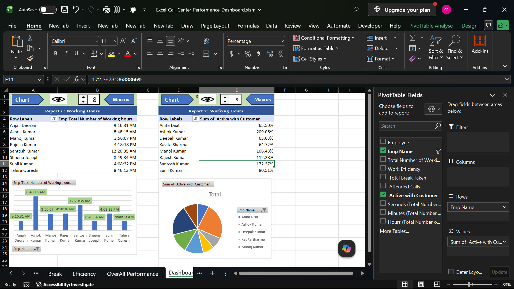
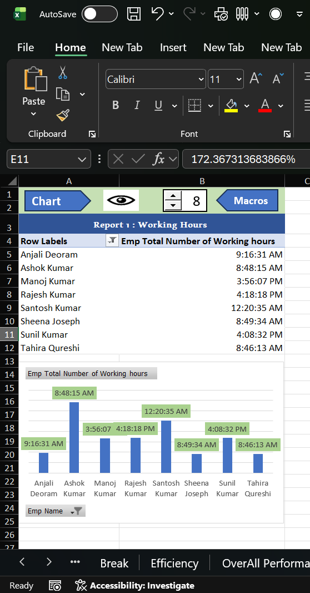
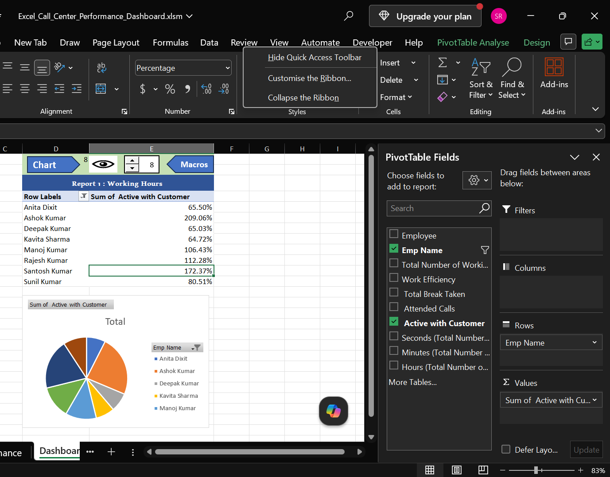

# 📊 Excel Call Center Performance Dashboard

An interactive Microsoft Excel dashboard developed to analyze call center employee performance using **Pivot Tables, Pivot Charts, VBA Macros, and Form Controls**.

> **Portfolio Project | Microsoft Excel | VBA | Data Analysis**

---

# 📌 Project Overview

This project demonstrates how Microsoft Excel can be used to build an interactive dashboard for analyzing call center employee performance.

The dashboard contains interactive reports that allow users to explore employee performance using Pivot Tables, Charts, VBA Macros, and Form Controls.

To protect privacy, the original dataset was modified and anonymized before being used in this project.

---

# 🎯 Project Objectives

- Analyze employee working hours.
- Monitor employee active customer engagement.
- Create an interactive Excel dashboard.
- Automate dashboard interaction using VBA Macros.
- Practice business reporting using Excel.

---

# 📊 Dashboard Reports

## 📌 Report 1 – Employee Working Hours

Displays the employees' total working hours using:

- Pivot Table
- Column Chart
- VBA Macro
- Form Controls

---

## 📌 Report 2 – Active with Customer Analysis

Displays employee customer engagement percentage using:

- Pivot Table
- Pie Chart
- VBA Macro
- Form Controls

---

# ✨ Features

- Interactive Excel Dashboard
- Pivot Tables
- Pivot Charts
- VBA Automation
- Form Controls (Spinner & Buttons)
- Dynamic Report Navigation
- Interactive Chart Visibility
- Modified Call Center Dataset

---

# 🛠 Tools & Technologies

- Microsoft Excel
- Pivot Tables
- Pivot Charts
- VBA (Visual Basic for Applications)
- Form Controls
- Conditional Formatting
- GETPIVOTDATA

---

# 📂 Repository Contents

| File | Description |
|------|-------------|
| Excel_Call_Center_Performance_Dashboard.xlsm | Interactive Excel Dashboard |
| Modified_Call_Center_Dataset.xlsx | Modified Dataset used in the project |

---

# 📈 Skills Demonstrated

- Data Cleaning
- Data Preparation
- Dashboard Design
- Data Visualization
- Business Reporting
- Excel Automation
- VBA Programming
- Interactive Dashboard Development

---

# 📂 Dataset Information

The dataset used in this project is based on a call center business scenario.

For privacy and security purposes:

- Employee names were modified.
- Data was anonymized.
- No confidential business information is included.

This repository is intended solely for learning and portfolio purposes.

---

# 🚀 How to Use

1. Download the repository.
2. Open **Excel_Call_Center_Performance_Dashboard.xlsm**.
3. Enable Macros when prompted.
4. Open the **Dashboard** sheet.
5. Use the buttons and spinner controls to interact with the reports.

---

# 📸 Dashboard Preview

The following screenshots showcase the interactive reports included in the dashboard.

## 🏠 Dashboard

---

## ⏱️ Employee Working Hours Report

---

## 👥 Active with Customer Report

---

# 📚 Learning Outcomes

Through this project, I practiced:

- Excel Dashboard Development
- Pivot Table Reporting
- Pivot Chart Creation
- VBA Automation
- Interactive Report Design
- Business Data Analysis

---

# 👨‍💻 Author

**Sumit Raj Singh**

Aspiring Data Analyst

### Skills

- Microsoft Excel
- SQL
- Power BI
- Python

---

⭐ If you found this project helpful, consider giving this repository a Star.
